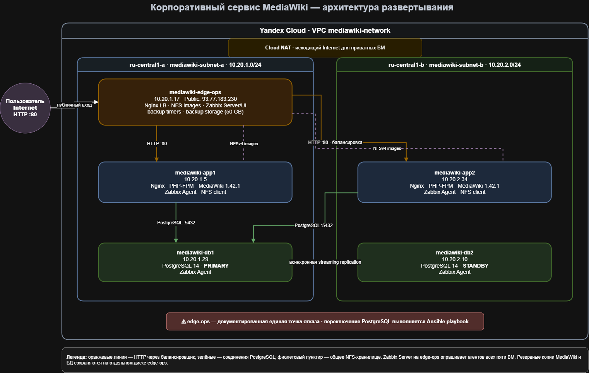

# MediaWiki corporate documentation service

Учебный проект развёртывания корпоративной базы знаний на основе MediaWiki в Yandex Cloud.

## Архитектура

[](docs/mediawiki-architecture.drawio)

Редактируемый исходник: [mediawiki-architecture.drawio](docs/mediawiki-architecture.drawio).

| Узел | Внутренний IP | Зона | Назначение |
|---|---|---|---|
| edge-ops | 10.20.1.17 | ru-central1-a | Nginx load balancer, NFS, Zabbix, backups |
| app1 | 10.20.1.5 | ru-central1-a | MediaWiki, Nginx, PHP-FPM |
| app2 | 10.20.2.34 | ru-central1-b | MediaWiki, Nginx, PHP-FPM |
| db1 | 10.20.1.29 | ru-central1-a | PostgreSQL primary или standby |
| db2 | 10.20.2.10 | ru-central1-b | PostgreSQL primary или standby |

Публичный адрес MediaWiki:

```text
http://93.77.183.230/
```

Интерфейс Zabbix:

```text
http://93.77.183.230/zabbix/
```

Узлы приложений и баз данных не имеют публичных IP-адресов. Исходящий доступ в интернет обеспечивается Cloud NAT. Подключение по SSH выполняется через `edge-ops` как jump host.

## Используемые компоненты

- Ubuntu 22.04;
- Terraform;
- Ansible;
- MediaWiki 1.42.1;
- Nginx;
- PHP-FPM;
- PostgreSQL 14;
- асинхронная потоковая репликация PostgreSQL;
- NFSv4;
- Zabbix 7.0;
- systemd timers;
- Yandex Cloud NAT.

## Структура проекта

```text
mediawiki-project/
├── ansible/
│   ├── group_vars/
│   ├── roles/
│   ├── configure-primary.yml
│   ├── create-wiki-db.yml
│   ├── promote-primary.yml
│   ├── rebuild-standby.yml
│   └── site.yml
├── docs/
│   └── recovery-plan.md
├── terraform/
│   ├── compute.tf
│   ├── main.tf
│   ├── network.tf
│   ├── variables.tf
│   └── terraform.tfvars.example
├── .gitignore
└── README.md
```

## Terraform

### Подготовка переменных

Создать рабочий файл на основе примера:

```bash
cd ~/mediawiki-project/terraform
cp terraform.tfvars.example terraform.tfvars
nano terraform.tfvars
```

Пример:

```hcl
folder_id       = "your-folder-id"
ssh_public_key  = "ssh-ed25519 AAAA... user@management-host"
management_cidr = "10.10.0.0/16"
```

Файл `terraform.tfvars` не сохраняется в Git.

### Создание инфраструктуры

```bash
terraform init
terraform fmt -check -recursive
terraform validate
terraform plan
terraform apply
```

Terraform создаёт:

- сеть VPC;
- две подсети в разных зонах;
- security groups;
- пять виртуальных машин;
- отдельный диск для NFS и резервных копий;
- Cloud NAT;
- таблицу маршрутизации;
- статический публичный IP для `edge-ops`.

Изменение актуального образа семейства Ubuntu игнорируется для уже созданных загрузочных дисков. Это предотвращает непреднамеренное пересоздание всех VM при выходе нового образа.

Проверка состояния:

```bash
terraform plan -detailed-exitcode
echo $?
```

Код `0` означает, что реальная инфраструктура соответствует конфигурации.

## Подключение к узлам

Проверка Ansible:

```bash
cd ~/mediawiki-project/ansible

ansible all \
  -m ping \
  --ask-vault-pass
```

Проверка повышения привилегий:

```bash
ansible all \
  -b \
  -m command \
  -a 'id -u' \
  --ask-vault-pass
```

Ожидаемый результат:

```text
0
```

## Основная настройка Ansible

```bash
cd ~/mediawiki-project/ansible

ansible-playbook site.yml \
  --ask-vault-pass
```

`site.yml` настраивает:

- общие диагностические пакеты;
- Zabbix Agent на всех узлах;
- NFS-сервер;
- отдельный файловый раздел;
- общий каталог изображений;
- MediaWiki;
- Nginx;
- PHP-FPM;
- NFS-клиенты;
- PostgreSQL;
- резервное копирование;
- Zabbix server;
- web-интерфейс Zabbix;
- публичный Nginx load balancer.

Повторный запуск `site.yml` проверен на идемпотентность:

```text
changed=0
unreachable=0
failed=0
```

## Первичная настройка PostgreSQL

Текущие узлы primary и standby задаются в файле:

```text
ansible/group_vars/all/vars.yml
```

Настройка primary:

```bash
ansible-playbook configure-primary.yml \
  --ask-vault-pass
```

Создание ролей и базы MediaWiki:

```bash
ansible-playbook create-wiki-db.yml \
  --ask-vault-pass
```

Создание standby из primary:

```bash
ansible-playbook rebuild-standby.yml \
  --ask-vault-pass \
  -e confirm_rebuild=true
```

Плейбук `rebuild-standby.yml` удаляет каталог PostgreSQL только на узле, указанном как standby.

## Настройка MediaWiki

Архив MediaWiki автоматически загружается с официального сайта и проверяется по SHA256.

Если `LocalSettings.php` отсутствует, Ansible сообщает о необходимости один раз пройти web-установщик MediaWiki.

После установки файл `LocalSettings.php` должен быть размещён на обеих application-нодах.

Повторный запуск `site.yml` автоматически управляет следующими параметрами:

- публичный адрес MediaWiki;
- адрес PostgreSQL primary;
- имя базы;
- пользователь базы;
- пароль базы;
- secret key;
- upgrade key;
- владелец и права файла.

Права файла:

```text
www-data:www-data 0600
```

## Nginx load balancer

Nginx на `edge-ops` распределяет запросы между:

```text
10.20.1.5:80
10.20.2.34:80
```

Используется механизм `ip_hash`.

При недоступности одного backend запросы направляются на второй.

Проверка:

```bash
ssh mw-edge '
for i in 1 2 3; do
  curl -sS -o /dev/null \
    -w "HTTP %{http_code}, %{time_total}s\n" \
    http://127.0.0.1/index.php
done
'
```

## NFS

Отдельный диск монтируется на `edge-ops`:

```text
/srv/mediawiki-data
```

Общий каталог изображений:

```text
/srv/mediawiki-data/images
```

На application-нодах он монтируется в:

```text
/var/www/mediawiki/images
```

Проверка:

```bash
ssh mw-app1 '
findmnt -T /var/www/mediawiki/images
sudo -u www-data touch \
  /var/www/mediawiki/images/.nfs-test
'

ssh mw-app2 '
sudo test -f \
  /var/www/mediawiki/images/.nfs-test &&
echo "NFS shared write/read: OK"
'

ssh mw-app1 '
sudo -u www-data rm \
  /var/www/mediawiki/images/.nfs-test
'
```

## Zabbix

На всех пяти узлах установлен Zabbix Agent.

На `edge-ops` работают:

- PostgreSQL для базы Zabbix;
- Zabbix server;
- Apache на `127.0.0.1:8080`;
- web-интерфейс Zabbix;
- Nginx reverse proxy для `/zabbix/`.

Проверка:

```bash
ssh mw-edge '
systemctl is-active \
  zabbix-server \
  zabbix-agent \
  apache2

curl -sS -o /dev/null \
  -w "Zabbix HTTP %{http_code}\n" \
  http://127.0.0.1/zabbix/
'
```

## Резервное копирование

Файловая резервная копия создаётся ежедневно:

```text
02:00 UTC
```

Дамп PostgreSQL создаётся каждые шесть часов:

```text
00:00, 06:00, 12:00, 18:00 UTC
```

Срок хранения:

```text
14 дней
```

Таймеры используют `Persistent=true`, поэтому пропущенное при выключенной VM задание выполняется после запуска.

Проверка:

```bash
ssh mw-edge '
systemctl list-timers --all "mediawiki-*"
'
```

Ручной запуск:

```bash
ssh mw-edge '
sudo systemctl start mediawiki-backup@database.service
sudo systemctl start mediawiki-backup@files.service
'
```

Каталоги:

```text
/srv/mediawiki-data/backups/database
/srv/mediawiki-data/backups/filesystem
```

## Аварийное переключение PostgreSQL

Перед продвижением standby старая primary обязательно должна быть остановлена или изолирована.

Пример переключения с db1 на db2:

```bash
ansible-playbook promote-primary.yml \
  --ask-vault-pass \
  -e new_primary_host=db2 \
  -e old_primary_host=db1
```

После возвращения старого узла он пересоздаётся как standby:

```bash
ansible-playbook rebuild-standby.yml \
  --ask-vault-pass \
  -e confirm_rebuild=true
```

Подробная процедура находится в:

```text
docs/recovery-plan.md
```

## Проверенные сценарии

В проекте проверены:

- работа двух application-нод;
- балансировка запросов;
- отказ app1;
- продолжение работы через app2;
- восстановление app1;
- загрузка изображения в MediaWiki;
- доступ к изображению через обе application-ноды;
- работа общего NFS;
- создание резервных копий;
- чтение файлового архива;
- тестовое восстановление PostgreSQL;
- остановка PostgreSQL primary;
- продвижение standby;
- переключение MediaWiki на новую primary;
- переключение резервного копирования;
- пересоздание старой primary как standby;
- восстановление репликации `streaming`;
- повторный безопасный запуск playbook восстановления;
- идемпотентность Ansible;
- отсутствие изменений в Terraform plan.

## Ограничения

`edge-ops` остаётся единой точкой отказа для публичного входа и NFS.

Рабочие данные NFS и локальные резервные копии находятся на одном дополнительном диске.

Для учебного проекта восстановление `edge-ops` выполняется через Terraform и Ansible.

## Секреты

Пароли хранятся только в зашифрованном файле:

```text
ansible/group_vars/all/vault.yml.example
```

Просмотр:

```bash
ansible-vault view \
  group_vars/all/vault.yml \
  --ask-vault-pass
```

Редактирование:

```bash
ansible-vault edit \
  group_vars/all/vault.yml \
  --ask-vault-pass
```

Пароль Vault, Terraform state, локальные `tfvars`, приватные SSH-ключи и сохранённые Terraform plans в Git не добавляются.
